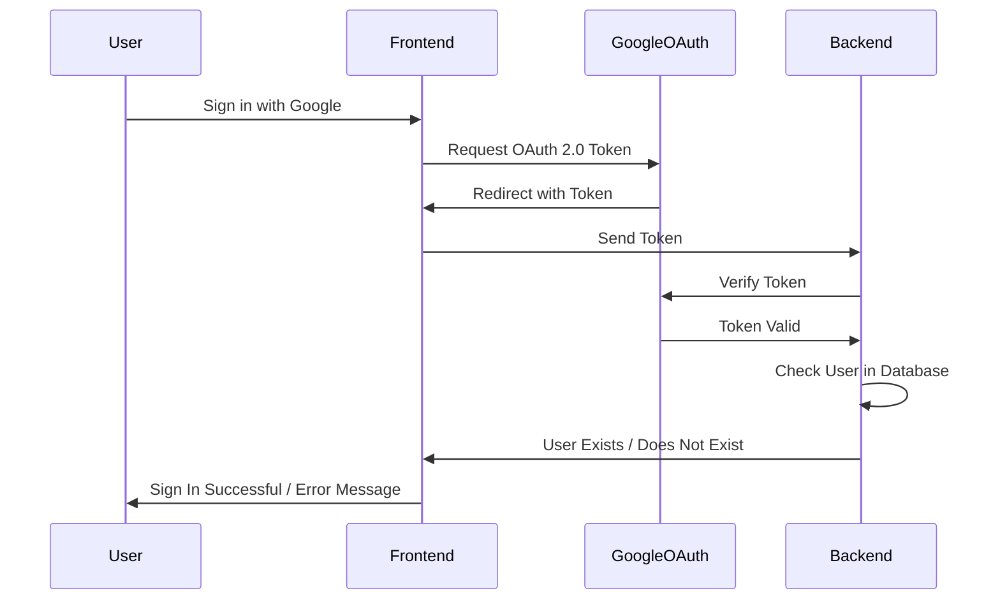

## 認証フロー

以下は、Google OAuth2 を使用したクライアント（React）とサーバー（Fastify）間の認証フローを示すシーケンス図です：

```mermaid
sequenceDiagram
    participant User
    participant Frontend
    participant GoogleOAuth
    participant Backend

    User ->> Frontend: Sign in with Google
    Frontend ->> GoogleOAuth: Request OAuth 2.0 Token
    GoogleOAuth ->> Frontend: Redirect with Token
    Frontend ->> Backend: Send Token
    Backend ->> GoogleOAuth: Verify Token
    GoogleOAuth ->> Backend: Token Valid
    Backend ->> Backend: Check User in Database
    Backend ->> Frontend: User Exists / Does Not Exist
    Frontend ->> User: Sign In Successful / Error Message
```

## その他のセクション

プロジェクトの他の情報をここに記述します。
